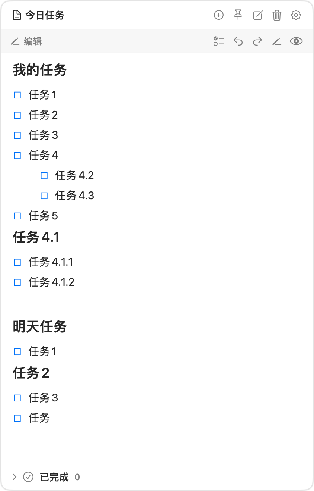

# MenuNote 便签

[English](README.en.md)

macOS 菜单栏 Markdown 便签工具。驻留在菜单栏（无 Dock 图标），按全局快捷键随时呼出/隐藏一个悬浮面板，在任何桌面、甚至全屏应用上方直接显示，不抢焦点、不用切换到桌面。

## 功能

- **菜单栏驻留**：状态栏图标，左键呼出/隐藏面板，右键打开菜单
- **全局快捷键**：默认 `⌥空格`，按下呼出、再按隐藏；在设置中点击快捷键区域并按下任意组合键即可自定义
- **悬浮面板**：不抢当前应用焦点；点击图钉可固定为跨空间置顶常驻，取消固定后失焦自动隐藏；位置自动记忆
- **所见即所得编辑**：始终直接编辑排版内容，不显示 `#`、`**`、`- [ ]` 等源标记；支持标题、粗体、斜体、删除线、行内代码、链接、引用、代码块和列表
- **任务归档**：勾选任务会自动写入 `[完成时间: yyyy-MM-dd HH:mm:ss]`，从主清单隐藏并移入底部可展开的“已完成”区域；在该区域可编辑、取消完成、删除单项或清除全部记录
- **多种内容视图**：默认是所见即所得编辑；工具栏 ✏️ 可切换 Markdown 原文编辑，工具栏 👁 可打开只读预览，`⌘E` 在排版编辑和原文编辑间切换
- **多便签**：每条便签是一个独立 `.md` 文件，可新建、重命名、删除（移到废纸篓）
- **自动保存**：编辑防抖自动落盘；外部修改（其他编辑器/iCloud）自动重载
- **登录自启**：可选开机自动运行

## 界面预览



## 数据位置

```
~/Library/Application Support/MenuNote/Notes/*.md
```

就是普通的 markdown 文件，可以用任何编辑器打开，也可以放进 iCloud/坚果云等同步目录（后续版本支持自定义目录）。

## 构建与安装

需要 Xcode 15（或 Command Line Tools）：

```bash
./Scripts/build_app.sh
```

产物在 `build/MenuNote.app`，拖到「应用程序」文件夹后双击运行。

开发调试：

```bash
swift run          # 直接跑（无 app 包，登录自启不可用）
swift build        # 仅编译
swift test         # 运行 Markdown 解析器单元测试
```

## 使用提示

- `⌥空格`（或当前自定义的快捷键）：呼出 / 隐藏
- 快捷键设置：打开齿轮设置，点击快捷键框后按下任意组合键；必须包含 `⌃`、`⌥`、`⇧` 或 `⌘`，`Esc` 取消本次录制
- 任务编辑：新建便签后默认就是可直接输入的任务；点击工具栏 checklist 图标添加任务；`Tab` / `⇧Tab` 创建或取消子任务；所有子任务完成时父任务自动完成；删除最后一个任务后会自动保留一个新的任务输入框；底部“已完成”可展开查看、修改，点击完成方框即可恢复为未完成
- 清除已完成：展开“已完成”区域，点击右侧垃圾桶并二次确认后，可删除全部已完成任务
- `⌘A`：全选编辑区内容
- `⌘B` / `⌘I`：对选中文本应用粗体 / 斜体
- `⌘E`：在排版编辑和 Markdown 原文编辑间切换
- `⌘D`：复制当前行或选中行块
- `⌘⇧7`：将选中段落切换为有序列表
- `⌘K`：系统链接命令
- `Esc`：隐藏面板
- 固定窗口：点击工具栏图钉，或右键菜单栏图标勾选“固定窗口”；固定后面板失焦不隐藏

## 卸载

1. 菜单栏图标右键 → 退出 MenuNote
2. 删除 `MenuNote.app`
3. 如需清空数据：删除 `~/Library/Application Support/MenuNote`
